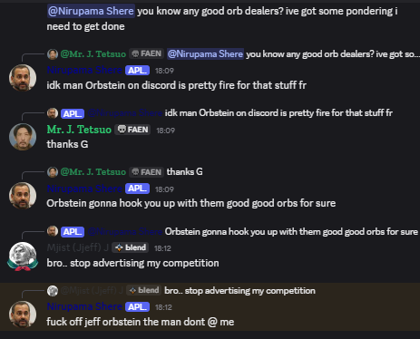
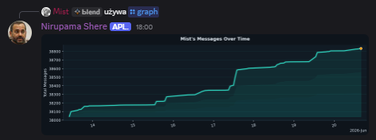

# Nirupama Discord Bot

# [Add Nirupama Now!](https://nirupama.mista.tech)

A versatile Discord bot with AI capabilities, fun utilities, and server management features. Nirupama combines personality-driven AI interactions with practical Discord tools to enhance your server experience.

# About:
- Nirupama is one of my largest, long lasting, learning project. Evolving from a basic, level bot, using a json file to store data, to what it is now. a multi purpose bot. While the bot doesn't server any one specific goal, and constantly changes, it is my #1 playground for experimentation with diferent technologies & ideas. 
- Currently nirupama uses a supabase postgress db for tracking user levels over time, has an ai chatbot built in, which prevously had much more features, and is currently also due for massive improvements and rewrites, it has the most in depth /ship command of any bot, looking at user data to get a relatively accurate value, instead of a random generated percentage. this feature is also due for large rewrites soon, to function more closely with the ai features, and activity frequency data gathered by the bot, allowing for a more fun, and interesting experience

# Features:
## Ai chatbot

  

## Activity Tracking

  

## Uptime monitoring via Cronitor

  

(real time uptime)